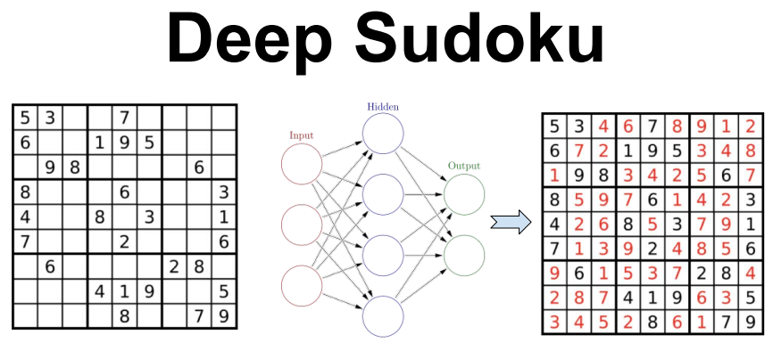
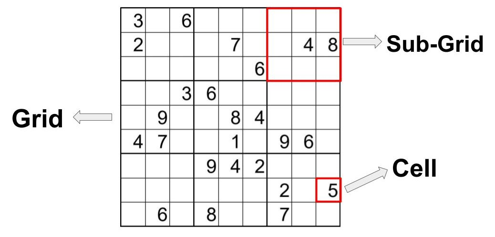

[](https://opensource.org/licenses/MIT)
[](https://travis-ci.com/ankandrew/DeepSudoku)





### Intro

Using neural nets to learn how to play Sudoku through Supervised Learning.

*Implemented using PyTorch framework*

### Requirements

Python 3.7+ is required among with the packages found in [requirements.txt](requirements.txt)

### Generate

A sudoku is firt generated and then is masked with 0's with certain probability. The latter is used as
**feature**/**input** to the model while the former one is used as the **ground truth**.

#### Single

```python
from deep_sudoku.data.generator import Generator

gen = Generator()
x, y = gen()
```

###### X sample

```python
array(
    [
        [4, 1, 3, 0, 0, 2, 0, 0, 0],
        [0, 5, 2, 0, 6, 0, 0, 0, 0],
        [0, 0, 0, 4, 0, 3, 0, 0, 2],
        [0, 2, 7, 6, 0, 0, 0, 0, 0],
        [0, 8, 0, 0, 0, 9, 0, 2, 0],
        [0, 0, 9, 0, 0, 7, 0, 8, 4],
        [0, 9, 5, 0, 7, 6, 0, 0, 0],
        [2, 0, 0, 8, 0, 1, 3, 9, 0],
        [0, 0, 0, 0, 0, 0, 0, 7, 0]
    ]
)
```

###### Y sample

```python
array(
    [
        [4, 1, 3, 9, 5, 2, 7, 6, 8],
        [9, 5, 2, 7, 6, 8, 4, 1, 3],
        [7, 6, 8, 4, 1, 3, 9, 5, 2],
        [5, 2, 7, 6, 8, 4, 1, 3, 9],
        [6, 8, 4, 1, 3, 9, 5, 2, 7],
        [1, 3, 9, 5, 2, 7, 6, 8, 4],
        [3, 9, 5, 2, 7, 6, 8, 4, 1],
        [2, 7, 6, 8, 4, 1, 3, 9, 5],
        [8, 4, 1, 3, 9, 5, 2, 7, 6]
    ]
)
```

#### Multiple

For example, to generate a dataset of 10 000 Sudokus:

```python
from deep_sudoku.data.generator import Generator

gen = Generator()
x, y = gen.generate_dataset(n=10_000)
```

### Validate

The [Validator](deep_sudoku/data/validator.py) class is responsible for validating a sudoku. For example If we want to
validate the following Sudoku:

```python
from deep_sudoku.data.validator import Validator
import numpy as np

sudoku = np.array(
    [
        [6, 2, 4, 8, 5, 3, 1, 9, 7],
        [8, 5, 3, 1, 9, 7, 6, 2, 4],
        [1, 9, 7, 6, 2, 4, 8, 5, 3],
        [9, 7, 6, 2, 4, 8, 5, 3, 1],
        [2, 4, 8, 5, 3, 1, 9, 7, 6],
        [5, 3, 1, 9, 7, 6, 2, 4, 8],
        [4, 8, 5, 3, 1, 9, 7, 6, 2],
        [3, 1, 9, 7, 6, 2, 4, 8, 5],
        [7, 6, 2, 4, 8, 5, 3, 1, 9]
    ], dtype=np.int8)

val = Validator()
val(sudoku)
```

### Train

To train run `train.py`. Usage:

```
usage: train.py [-h] [--epochs EPOCHS] [--lr LR] [--batch BATCH_SIZE]
                [--n-train N_TRAIN] [--n-test N_TEST] [--device DEVICE]

Sudoku Model Training

optional arguments:
  -h, --help          show this help message and exit
  --epochs EPOCHS     Number of epochs for model to train (default = 350)
  --lr LR             Initial learning rate (default = 0.0001)
  --batch BATCH_SIZE  Bactch size (default = 128)
  --n-train N_TRAIN   Number of sudokus to generate for training (default = 10
                      000)
  --n-test N_TEST     Number of sudokus to generate for test (default = 2 500)
  --device DEVICE     Device to be used for training/testing (default = cpu)
```

### Metrics

With the following naming convention:



We define two different metrics:
* **Accuracy**: measures what porcentage of cells were correctly classified compared to the ground truth.
* **Grid Accuracy**: measures what porcentage of entire sudoku grids were classified correctly. 

**_Grid accuracy_** is preferred since it classifies as correct a sudoku that has a
**valid solution** and may be different to groundth truth (there are more than
one solution sometimes). More about the metrics can be found at [metric.py](deep_sudoku/metric.py).

#### Models comparison

| Architecture        | Accuracy  | Grid Accuracy  |
| :-------------: |:-------------:| -----:|
| Dense       | -  | -  |
| Conv        | -  |  - |
| Recurrent (Encoder + Decoder) | -  | - |
| Transformer | -  | -  |

### TODO

- [x] Dense/Conv models
- [ ] Recurrent(Encoder/Decoder) model
- [ ] Transformer
- [ ] Model checkpoints
- [ ] Reproducible trained models
- [ ] Optimize Grid Accuracy speed
